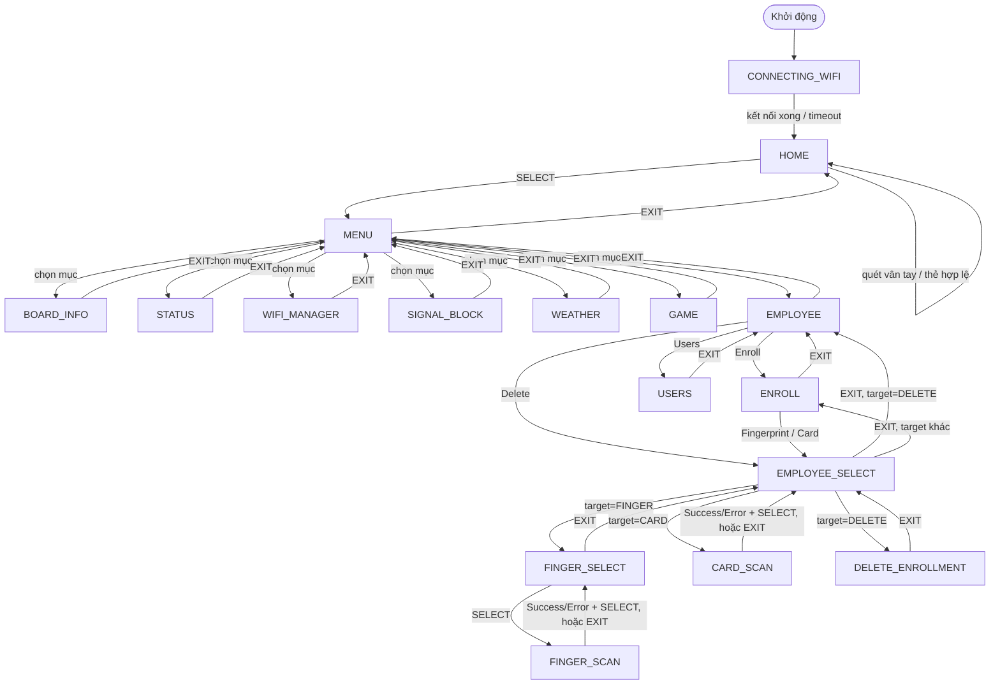

# Luồng màn hình (Screen Flow)

Tài liệu mô tả toàn bộ luồng điều hướng giữa các màn hình OLED của thiết bị
chấm công (ESP32-S3 + AS608 + RFID). Nguồn: `src/attendance/screens/`,
`src/attendance/display/ScreenManager.{h,cpp}`.

## Kiến trúc điều hướng

- Mỗi màn hình implement interface `IScreen` (`onEnter()`, `onExit()`, `loop()`)
  — xem [IScreen.h](src/attendance/screens/IScreen.h).
- `ScreenManager` giữ **một instance duy nhất** cho mỗi màn hình (không tạo/huỷ
  động) và chuyển màn hình bằng `showScreen(ScreenId)` →
  gọi `onExit()` màn cũ rồi `onEnter()` màn mới (xem
  [ScreenManager.cpp](src/attendance/display/ScreenManager.cpp)).
- Danh sách `ScreenId` đầy đủ: `HOME, CONNECTING_WIFI, MENU, BOARD_INFO,
  WIFI_MANAGER, STATUS, WEATHER, SIGNAL_BLOCK, GAME, EMPLOYEE, ENROLL,
  EMPLOYEE_SELECT, FINGER_SELECT, FINGER_SCAN, USERS, CARD_SCAN,
  DELETE_ENROLLMENT` ([ScreenId.h](src/attendance/screens/ScreenId.h)).
- 6 nút vật lý: `UP, DOWN, LEFT, RIGHT, SELECT, EXIT`
  ([ButtonManager.h](src/attendance/input/ButtonManager.h)). Quy ước chung
  trên các màn hình danh sách/menu: `UP/DOWN` = di chuyển con trỏ, `SELECT` =
  chọn/xác nhận, `EXIT` = quay lại màn trước.
- State điều hướng dùng chung được lưu trên `ScreenManager` (không thuộc
  riêng màn hình nào), vì nhiều màn hình cần đọc/ghi xuyên suốt luồng:
  - `_selectedEmployeeId` — nhân viên đang được thao tác.
  - `_selectedFingerIndex` — ngón tay đang enroll.
  - `_pendingEnrollTarget` (`EnrollTarget::FINGER | CARD | DELETE`) — cho
    `EmployeeSelectScreen` biết sau khi chọn nhân viên xong thì rẽ sang đâu
    ([EnrollTarget.h](src/attendance/screens/EnrollTarget.h)).

## Sơ đồ tổng quan



## Chi tiết từng nhóm luồng

### 1. Khởi động

`main.cpp::setup()`:

1. Hiển thị **CONNECTING_WIFI** trong lúc `wifiManager` đang connect (có
   timeout `CONNECT_WIFI_TIMEOUT`), animation icon Wi-Fi chạy qua từng frame
   mỗi `FRAME_DELAY_MS` ([ConnectingWifiScreen.cpp](src/attendance/screens/ConnectingWifiScreen.cpp)).
2. Nếu kết nối được: đồng bộ giờ (`timeManager.begin()`) và tải danh sách
   nhân viên từ server (`apiService.fetchEmployees`).
3. Luôn chuyển sang **HOME** sau đó, bất kể Wi-Fi có kết nối được hay không.

### 2. HOME — màn hình mặc định

[HomeScreen.cpp](src/attendance/screens/HomeScreen.cpp) có 2 trạng thái nội bộ (`IdleState`):

- **CLOCK**: hiển thị giờ/ngày, icon Wi-Fi, icon pin/sạc. Tự cập nhật giờ
  định kỳ (`_getTimeTimer`), không cần vẽ lại toàn màn hình.
- **RESULT**: hiện tên nhân viên + "Checked in!" hoặc "Not registered" sau
  khi quét vân tay/thẻ, giữ trong `RESULT_DISPLAY_TIMEOUT` rồi tự quay lại
  CLOCK.

Trong lúc ở CLOCK, mỗi vòng `loop()` đều poll song song:

- **Vân tay**: `fingerprintService.verifyStep()` → nếu khớp, tra
  `EnrollmentStore` ra `employeeId`, log chấm công (`AttendanceLog::append`),
  đồng bộ lên server (`ApiService::syncPendingAttendance`), phát âm
  thanh/đèn LED tương ứng.
- **Thẻ RFID**: tương tự, tra theo UID thẻ (throttle bằng `_cardPollTimer`).

Điều hướng: `SELECT` → **MENU**. Không có nút EXIT ở Home (đây là màn gốc).

### 3. MENU — menu chính

[MenuScreen.cpp](src/attendance/screens/MenuScreen.cpp): danh sách cuộn dọc
`MENU_ITEMS[]`, mỗi item map thẳng tới một `ScreenId`:

| Icon/Tên       | Đích               |
|----------------|--------------------|
| Board Info     | `BOARD_INFO`       |
| Status         | `STATUS`           |
| Wi-Fi List     | `WIFI_MANAGER`     |
| Block Signals  | `SIGNAL_BLOCK`     |
| Weather        | `WEATHER`          |
| Game           | `GAME`             |
| Employee       | `EMPLOYEE`         |

`UP/DOWN` cuộn qua các item (hiện 2 item/trang + scrollbar), `SELECT` mở màn
tương ứng, `EXIT` quay về **HOME**.

### 4. Các màn thông tin/tiện ích (nhánh lá, đều quay lại MENU bằng EXIT)

Các màn hình sau chỉ hiển thị thông tin, không rẽ nhánh tiếp — `EXIT` luôn
đưa thẳng về **MENU**:

- **BOARD_INFO** — thông tin phần cứng/chip ([BoardInfoScreen.cpp](src/attendance/screens/BoardInfoScreen.cpp)).
- **STATUS** — trạng thái hệ thống ([StatusScreen.cpp](src/attendance/screens/StatusScreen.cpp)).
- **WIFI_MANAGER** — danh sách/quản lý Wi-Fi ([WifiManagerScreen.cpp](src/attendance/screens/WifiManagerScreen.cpp)).
- **SIGNAL_BLOCK** — chặn tín hiệu ([SignalBlockScreen.cpp](src/attendance/screens/SignalBlockScreen.cpp)).
- **WEATHER** — thời tiết ([WeatherScreen.cpp](src/attendance/screens/WeatherScreen.cpp)).

### 5. GAME — mini-game

[GameScreen.cpp](src/attendance/screens/GameScreen.cpp) có state máy riêng
(`State::MENU` / `State::PLAYING`), độc lập với `ScreenId` chung:

- Ở `MENU`: chọn Snake hoặc Pong (`Play`), `EXIT` → **MENU** (màn ScreenId).
- Ở `PLAYING`: điều khiển game (`IGame` interface —
  [IGame.h](src/attendance/games/IGame.h), implement bởi
  [SnakeGame](src/attendance/games/SnakeGame.h) /
  [PongGame](src/attendance/games/PongGame.h)); `EXIT` thoát về state `MENU`
  nội bộ (không rời khỏi GameScreen), `SELECT` restart khi game over.

### 6. EMPLOYEE — quản lý nhân viên (gốc của các luồng enroll/xoá)

[EmployeeScreen.cpp](src/attendance/screens/EmployeeScreen.cpp), danh sách 3
mục:

| Mục       | Hành động |
|-----------|-----------|
| Enroll    | → **ENROLL** |
| Users     | → **USERS** |
| Delete    | set `_pendingEnrollTarget = DELETE` → **EMPLOYEE_SELECT** |

`EXIT` → **MENU**.

- **USERS**: danh sách nhân viên (chỉ xem), `EXIT` → **EMPLOYEE**
  ([UsersScreen.cpp](src/attendance/screens/UsersScreen.cpp)).

### 7. Luồng Enroll (vân tay hoặc thẻ)

[EnrollScreen.cpp](src/attendance/screens/EnrollScreen.cpp) — chọn loại
enroll:

- `Fingerprint` → set `_pendingEnrollTarget = FINGER` → **EMPLOYEE_SELECT**
- `Card` → set `_pendingEnrollTarget = CARD` → **EMPLOYEE_SELECT**
- `EXIT` → **EMPLOYEE**

**EMPLOYEE_SELECT** ([EmployeeSelectScreen.cpp](src/attendance/screens/EmployeeSelectScreen.cpp))
là điểm trung chuyển dùng chung cho cả 3 luồng (Enroll vân tay, Enroll thẻ,
Delete). Sau khi chọn nhân viên (`SELECT`, lưu `_selectedEmployeeId`), rẽ
nhánh theo `_pendingEnrollTarget`:

- `FINGER` → **FINGER_SELECT**
- `CARD` → **CARD_SCAN**
- `DELETE` → **DELETE_ENROLLMENT**

`EXIT` quay lại **EMPLOYEE** (nếu target là `DELETE`, vì luồng Delete xuất
phát trực tiếp từ Employee) hoặc **ENROLL** (nếu target là `FINGER`/`CARD`).

#### 7a. Enroll vân tay

**FINGER_SELECT** ([FingerSelectScreen.cpp](src/attendance/screens/FingerSelectScreen.cpp)):
danh sách 10 ngón (`FINGER_NAMES`), `SELECT` lưu `_selectedFingerIndex` →
**FINGER_SCAN**; `EXIT` → **EMPLOYEE_SELECT**.

**FINGER_SCAN** ([FingerScanScreen.cpp](src/attendance/screens/FingerScanScreen.cpp))
— state máy quét vân tay 2 lần để tạo template:

```
PLACE_1 → (đặt ngón) → REMOVE_1 → (nhấc ngón, chờ ổn định) → PLACE_2
→ (đặt lại) → SAVING → SUCCESS
                     ↘ ERROR (sensor lỗi / storage full / không khớp)
```

- Nếu sensor không kết nối khi vào màn: nhảy thẳng `ERROR`.
- `SUCCESS`/`ERROR` + `SELECT`, hoặc `EXIT` ở bất kỳ state nào → **FINGER_SELECT**
  (cho phép enroll tiếp ngón khác).

#### 7b. Enroll thẻ RFID

**CARD_SCAN** ([CardScanScreen.cpp](src/attendance/screens/CardScanScreen.cpp)):

```
PLACE → READING → DETECTED → (SELECT lưu mapping) → SUCCESS
                            ↘ ERROR (reader không kết nối)
```

`SUCCESS`/`ERROR` + `SELECT`, hoặc `EXIT` ở bất kỳ state nào →
**EMPLOYEE_SELECT**.

#### 7c. Xoá enrollment

**DELETE_ENROLLMENT** ([DeleteEnrollmentScreen.cpp](src/attendance/screens/DeleteEnrollmentScreen.cpp))
liệt kê các vân tay/thẻ đã enroll của nhân viên đang chọn, 3 mode nội bộ:

```
LIST (chọn item, UP/DOWN)
  → SELECT → CONFIRM (Yes/No)
       → SELECT (Yes) → xoá mapping + xoá template trên sensor nếu là vân tay → DONE
       → EXIT (No) → về LIST
  → EXIT → EMPLOYEE_SELECT
DONE → SELECT hoặc EXIT → build lại danh sách, về LIST
```

## Bảng tra nhanh: mỗi màn hình đi đâu khi bấm EXIT

| Màn hình             | EXIT đi tới                                   |
|-----------------------|-----------------------------------------------|
| HOME                  | (không có, là màn gốc)                        |
| MENU                  | HOME                                           |
| BOARD_INFO / STATUS / WIFI_MANAGER / SIGNAL_BLOCK / WEATHER / GAME (menu) | MENU |
| EMPLOYEE               | MENU                                          |
| ENROLL                 | EMPLOYEE                                      |
| USERS                  | EMPLOYEE                                      |
| EMPLOYEE_SELECT        | ENROLL (target FINGER/CARD) hoặc EMPLOYEE (target DELETE) |
| FINGER_SELECT          | EMPLOYEE_SELECT                               |
| FINGER_SCAN            | FINGER_SELECT                                 |
| CARD_SCAN              | EMPLOYEE_SELECT                               |
| DELETE_ENROLLMENT      | EMPLOYEE_SELECT                               |
